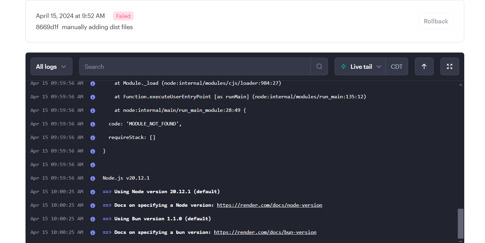

# amc_PWA_TextEditor
# Description

Your task is to build a text editor that runs in the browser. The app will be a single-page application that meets the PWA criteria. Additionally, it will feature a number of data persistence techniques that serve as redundancy in case one of the options is not supported by the browser. The application will also function offline.

To build this text editor, you will start with an existing application and implement methods for getting and storing data to an IndexedDB database. You will use a package called idb, which is a lightweight wrapper around the IndexedDB API. It features a number of methods that are useful for storing and retrieving data, and is used by companies like Google and Mozilla.

# User Story
AS A developer  
I WANT to create notes or code snippets with or without an internet connection  
SO THAT I can reliably retrieve them for later use  

# Acceptance Criteria
GIVEN a text editor web application  
WHEN I open my application in my editor  
THEN I should see a client server folder structure  
WHEN I run `npm run start` from the root directory  
THEN I find that my application should start up the backend and serve the client  
WHEN I run the text editor application from my terminal  
THEN I find that my JavaScript files have been bundled using webpack  
WHEN I run my webpack plugins  
THEN I find that I have a generated HTML file, service worker, and a manifest file  
WHEN I use next-gen JavaScript in my application  
THEN I find that the text editor still functions in the browser without errors  
WHEN I open the text editor  
THEN I find that IndexedDB has immediately created a database storage  
WHEN I enter content and subsequently click off of the DOM window  
THEN I find that the content in the text editor has been saved with IndexedDB  
WHEN I reopen the text editor after closing it  
THEN I find that the content in the text editor has been retrieved from our IndexedDB  
WHEN I click on the Install button  
THEN I download my web application as an icon on my desktop  
WHEN I load my web application  
THEN I should have a registered service worker using workbox  
WHEN I register a service worker  
THEN I should have my static assets pre cached upon loading along with subsequent pages and static assets  
WHEN I deploy to Render  
THEN I should have proper build scripts for a webpack application  

# Mock-Up
https://github.com/cortesporcz/amc_PWA_TextEditor/blob/main/README.md

https://amc-pwa-texteditor.onrender.com

# License
This project is licensed under the MIT license.

[License: MIT]

# Future Development
This is a challenge from UTSA Module 19 and is currently not complete. If you are looking at this as a resource, it is important to note that there are still numerous errors that need to be figured out. 